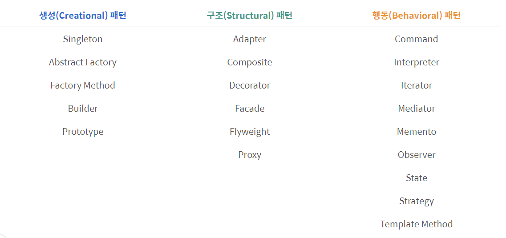
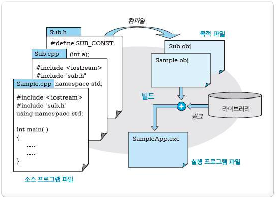
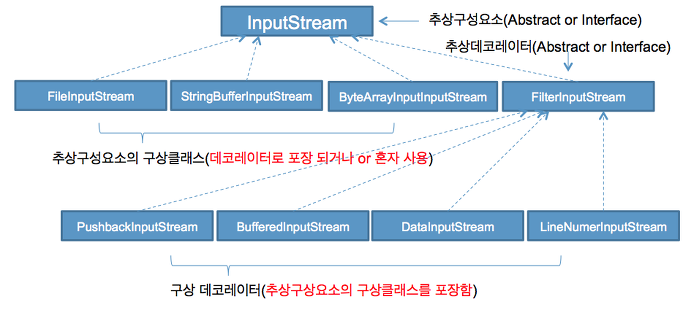

# 디자인 패턴

https://readystory.tistory.com/114

객체지향 프로그래밍에서 공통적인 디자인 문제를 찾아내고 해결하는 가이드

설계자들이 올바른 설계를 빨리 만들 수 있도록 도와줌

### 일반적인 디자인 패턴

> GoF 디자인 패턴

세 가지 범주로 구분: **생성, 행동, 구조**

- 패턴 종류



###### 생성패턴

인스턴스를 만드는 절차를 추상화하는 패턴, 객체를 생성, 합성, 표현 방법을 시스템과 분리

상속(inheritance) 보다 복함(composite) 방법을 사용하는 방향으로 진화

1. 시스템이 어떤 Concrete Class를 사용하는 지에 대한 정보 캡슐화
2. 클래스의 인스턴스들이 만들고 결합하는 부분을 가려줌


###### 구조패턴

작은 클래스들을 상속과 합성을 이용해 더 큰 클래스를 생성하는 방법을 제공

서로 독립적으로 개발한 클래스 라이브러리를 하나인 것처럼 사용

여러 인터페이스를 합성(Composite)하여 서로 다른 인터페이스들의 통일된 추상을 제공

> 런타임 단계에서 복합 방법이나 대상을 변경 -> **유연성**


###### 행동패턴

객체나 클래스 사이의 알고리즘이나 책임 분배에 관련된 패턴

한 객체가 수행할 수 없는 작업을 여러 개의 객체로 분배하여 **객체 사이의 결합도 최소화**에 중점


### [생성] 싱글톤 패턴

어떤 클래스의 인스턴스 개수가 **최대 한 개**를 넘지 않도록 하는 패턴

> 프로그램 시작부터 종료 시까지 어떤 클래스의 인스턴스가 메모리 상에 단 하나만 존재할 수 있게 하여 인스턴스에 대해 어디에서나 접근할 수 있도록 하는 패턴

ex) 로그, 쓰레드 풀, 윈도우 관리자 등 객체를 관리하는 역할을 하는 객체 -> 프로그램 내에서 단 하나의 인스턴스를 갖는 것이 좋음

- 공유자원에 대한 소통의 중심 역할

###### 접근방법

- 생성자를 클래스 내부에서 private static하게 만들어 클래스 외부에서 인스턴스를 생성하지 못하게 차단
- 내부에서는 단 하나의 인스턴스를 생성하여 접근 방법 제공

###### 구현

1. Eager Initalization

   > 싱글톤 클래스를 인스턴스 클래스 로딩 단계에서 생성하는 방법

   ```java
   public class Singleton {
       
       // 단 하나의 객체만 허용
       private static final Singleton instance = new Singleton();
       
       private Singleton(){}
    
       //
       public static Singleton getInstance(){
           return instance;
       }
   }
   ```

   - 인스턴스를 사용하지 않더라도 인스턴스를 생성하여 낭비가 발생할 수 있음
   - 큰 리소스에 부적합
   - Exception에 대한 핸들링 제공X

2. Static Block Initailzation

   > static block을 통해 Exception Handling 옵션 제공

   ```java
   public class Singleton {
    
       private static Singleton instance;
       
       private Singleton(){}
       
       //static block initialization for exception handling
       static{
           try{
               instance = new Singleton();
           }catch(Exception e){
               throw new RuntimeException("Exception occured in creating singleton instance");
           }
       }
       
       public static Singleton getInstance(){
           return instance;
       }
   }
   ```

3. Lazy Initalization

   > 나중에 초기화하는 방법

   ```java
   public class Singleton {
    
       private static Singleton instance;
       
       private Singleton(){}
       
       // 인스턴스가 존재하지 않다면 객체 생성
       public static Singleton getInstance(){
           if(instance == null){
               instance = new Singleton();
           }
           return instance;
       }
   }
   ```

   - 인스턴스 낭비 발생X
   - Multi-thread 환경에서 동기화 문제 발생
     - 인스턴스가 생성되지 않은 시점에 여러 쓰레드가 동시에 getInstance() 호출 시, 싱글톤 패턴 위반

4. Thread Safe Singleton

   > getInstance() 메소드에 synchronized를 걸어두는 방식

   ```java
   public class Singleton {
    
       private static Singleton instance;
       
       private Singleton(){}
       
       /*
       synchronized: 임계 영역(Critical Section)을 형성해 해당 영역에 오직 하나의 쓰레드만 접근 가능하게 함
       */
       public static synchronized Singleton getInstance(){
           if(instance == null){
               instance = new Singleton();
           }
           return instance;
       }
       
   }
   ```

   - synchronized 자체 비용이 크기 떄문에 어플리케이션 성능이 떨어짐

   ###### Double Checked Locking

   > instance가 null일 경우에만 synchronized 동작

   ```java
   public static Singleton getInstance(){
       if(instance == null){
           synchronized (Singleton.class) {
               if(instance == null){
                   instance = new Singleton();
               }
           }
       }
       return instance;
   }
   ```

5. **Bill Pugh Singleton Implementation**

   > inner static helper class를 사용, 가장 많이 쓰이는 싱글톤 구현 방식

   ```java
   public class Singleton {
    
       private Singleton(){}
       
       // inner class
       // getInstance가 호출 될 떄, SingletonHelper가 호출됨 -> Synchronized 문제 해결 및 낭비 예방
       private static class SingletonHelper{
           private static final Singleton INSTANCE = new Singleton();
       }
       
       public static Singleton getInstance(){
           return SingletonHelper.INSTANCE;
       }
   }
   ```

   - Refletion을 통해 싱글톤을 파괴할 수 있음

6. Enum Singleton

   ```java
   public enum EnumSingleton {
    
       INSTANCE;
       
       public static void doSomething(){
           //do something
       }
   }
   ```

   - 사용하지 않았을 경우 메모리 문제를 해결하지 못하고 유연성이 떨어지는 한계를 가짐


### [구조] 브릿지 패턴

**추상화(abstraction)**를 **구현(implement)**으로부터 분리하여 각각 독립적으로 변화할 수 있도록 하는 패턴 --> 독립적으로 다른 계층 구조를 가짐

- 클라이언트 어플리케이션으로부터 구현을 숨기고 싶을 때 사용



두 인터페이스의 compoistion 구성

```java
public interface Color {
 
	public void applyColor();
}
```

```java
public abstract class Shape {
	//Composition
	protected Color color; //Color 인터페이스 소유
	
	//constructor with implementor as input argument
	public Shape(Color c){
		this.color=c;
	}
	
    // 하위 클래스에게 구현을 위임
	abstract public void applyColor();
}
```


- Shape의 하위 클래스인 Triangle과 Pentagon이 applyColor를 구현함

```java
public class Triangle extends Shape {
 
	public Triangle(Color c) {
		super(c);
	}
 
	@Override
	public void applyColor() {
		System.out.print("Triangle filled with color ");
		color.applyColor();
	} 
 
}
```

```java
public class Pentagon extends Shape {
 
	public Pentagon(Color c) {
		super(c);
	}
 
	@Override
	public void applyColor() {
		System.out.print("Pentagon filled with color ");
		color.applyColor();
	} 
 
}
```


- Color 인터페이스 객체 구현

```java
public class RedColor implements Color{
 
	public void applyColor(){
		System.out.println("red.");
	}
}
```

```java
public class GreenColor implements Color{
 
	public void applyColor(){
		System.out.println("green.");
	}
}
```


- 테스트

```java
public class BridgePatternTest {
 
	public static void main(String[] args) {
		Shape tri = new Triangle(new RedColor());
		tri.applyColor();
		
		Shape pent = new Pentagon(new GreenColor());
		pent.applyColor();
	}
}
```

결과

```
Triangle filled with color red.
Pentagon filled with color green.
```


### [행동] 옵저버 패턴

https://velog.io/@hanna2100/%EB%94%94%EC%9E%90%EC%9D%B8%ED%8C%A8%ED%84%B4-2.-%EC%98%B5%EC%A0%80%EB%B2%84-%ED%8C%A8%ED%84%B4-%EA%B0%9C%EB%85%90%EA%B3%BC-%EC%98%88%EC%A0%9C-observer-pattern

어떤 객체의 상태가 변할 때 그와 연관된 객체들에게 **알림**을 보내는 디자인 패턴

- 1:N 객체 의존 관계 구성
- 데이터 변경 발생 시, 상대 클래스나 객체에 **의존하지 않고** 데이터 변경을 통보

ex) 새로운 파일이 추가/기존 파일 삭제 될 때 탐색기는 다른 탐색기에게 변경을 통보해야 함


- Subject Class(**주제**): 통보 대상 객체 관리 일반화

  > 데이터 변경을 통보하는 클래스(ConcreteSubjet)는 통보 대상 클래스나 객체(ConcreteObserver)에 대한 의존성을 없앰

  - 관찰 대상이 되는 객체
  - 자신을 관리하는 옵저버 리스트를 가지고 관리

```java
interface Subject {
	registerObserver() // 옵저버 등록
	removeObserver() // 옵저버 삭제
	notifyObserver() // 옵저버에게 업데이트 알림
}
```

- Observer Class(**관리**)
  - Subject을 관찰

```java
interface Observer{ // 옵저버가 될 객체에서는 반드시 Observer 인터페이스를 구현해야함.
	update() // 주제의 상태가 바뀌었을때 호출됨
}

class ObserverImpl implements Observer {
	update() { 
		// 주제가 업데이트 될 때 해야하는 일
	}
}
```


## 기타 패턴

### 빌더 패턴

객체가 어떤 식으로 구축되는 지에 대해 모르는 상황에서 **단계별로 객체를 생성하는 패턴**

- 객체를 직접 생성하는 대신 **빌더의 인스턴스**를 만들고 빌더에서 객체를 대신 만들도록 하는 방식

- 객체를 초기화하는 데 여러 생성자 매개변수가 필요한 경우 유용

```java
public class Window{
    public Window( boolean visible, boolean modal, boolean dialog){
        this.visible = visible;
        this.modal = modal;
        this.dialog = dialog;
    }
    private boolean visible;
    private boolean modal;
    private boolean dialog;
    
    ...
}
```

```java
public class WindowBuilder{
    public WindowBuilder(){}
    
    public WindowBuilder setDialog(boolean flag){
        dialog = flag;
        return this;
    }
    
    public WindowBuilder setModal(boolean flag){
        modal = flag;
        return this;
    }
    
    public WindowBuilder setVisible (boolean flag){
        visible = flag;
        return this;
    }
    
    public Window build(){
        return new Windows(visible, modal, dialog);
    }
    
    private boolean dialog;
    private boolean modal;
    private boolean visible;
}
```

```java
Window w =new WindowBuilder().setVisible(false).setModal(true).setDialog(true).build();
```

초기화 과정이 깔끔하고 이해하기 좋게 됨


### 추상 팩토리

팩토리의 구현과 팩토리를 사용하는 코드를 갈라주는 패턴

>#### 팩토리 메서드
>
>다른 객체를 만들 수 있는 객체
>
>새 객체를 만들어서 리턴하기 위한 용도로 만들어진 모든 메서드라는 개념을 클래스 계층구조에 적용한 것
>
>- 베이스 클래스: 서브 클래스에서 오버라이드 할 팩토리 메서드 정의
>- 새 객체 생성: 각 서브클래스에서 결정

###### 구현

- 추상 클래스로부터 상속된 일련의 팩토리 클래스로 구현
- 구현된 여러 팩토리 중 어떤 것을 사용할지 결정 -> 애플리케이션에서는 실제 클래스가 아닌 **추상 클래스**를 통해서만 팩토리를 참조
- 팩토리 선택: 실제 실행할 때까지 설정 파일 등을 통해 미뤄지거나 실행 도중 다른 팩토리 선택 가능
- 추상팩토리 구현 시 싱글톤 패턴을 사용할 때가 많음


### 반복자

자료구조에 있는 모든 원소를 가져올 수 있음 -> 각 원소가 어떤 식으로 저장되고 표현되는지에 대해서 신경쓰지 않음

단방향, 앙뱡항, 원소 추가/삭제 등 다양한 반복자 존재


### 데코레이터 패턴

한 객체를 그 객체와 같은 베이스 클래스로부터 파생되어 (원래 객체와 같은 메서드를 제공하는) 다른 객체로 감싸서 **객체의 행동**을 바꿔주는 패턴

- 메서드 호출을 그 기반이 되는 객체로 전달

###### 필요 클래스

- 구성요소: 기반 객체와 그 객체를 감싸는 데코레이터에서 필요한 **모든 공개 메서드를 정의**하는 추상클래스 or 인터페이스
- 구상 구성요소: 구상 구성요소와 데코레이터의 베이스 클래스 역할
- 데코레이터: 추상 클래스, 모든 데코레이터가 공유하는 기능 제공, 구상 구성요소를 감싸고 모든 메서드 호출을 구성요소로 전달
- 구상 데코레이터: 부모 데코레이터 클래스에 있는 메서드를 오버라이딩하여 감싸줄 구상 구성요소 클래스의 행동을 바꿈

ex) Java.io



```java
InputStream in = LineNumerInputStream(new BufferedInputStream(new FileInputStream(file)))
```

- InputStream: 모든 입력 스트림을 위한 부모 클래스(추상 클래스)
- FileInputStream: 스트림 입력에 대한 구현을 제공, 구상 구성요소 클래스
- BufferedInputStream: 구상 데코레이터 베이스 클래스


**Q. 상속 대신 데코레이터를 쓰는 이유는?**

공통점: 원래 클래스의 객체 행동을 바꾸는 방법을 제공

차이점

- 상속: 부모 클래스를 컴파일 시에 변경할 수 있음
  - 행동을 바꿔야 할 때마다 자식 클래스를 새로 생성해야함
- 데코레이터 패턴: 실행 시 동적으로 적용