# **DB 정규화?**

- 이상문제를 해결하기 위해 속성들 끼리의 종속 관계를 분석하여 여러개의 릴레이션으로 분해하는 과정입니다.

- 이상문제에는 삽입이상, 삭제이상, 갱신이상이 있습니다.

  - ## 삽입이상?

    - 데이터를 저장할 때 원하지 않는 정보가 함께 삽입되는 경우

  - ## 삭제이상?

    - 튜플을 삭제함으로써 유지되어야 하는 정보까지도 연쇄적으로 삭제되는 경우

  - ## 갱신이상?

    - 중복된 튜플 중 일부의 속성만 갱신시킴으로써 정보의 모순성이 발생하는 경우

    

- 정규화의 기본 목표는 테이블 간에 중복된 데이터를 허용하지 않는다는 것입니다. 중복된 데이터를 허용하지 않음으로써 무결성을 유지할 수 있고 DB의 저장 용량도 줄일 수 있습니다.

- 테이블을 분해하는 정규화 단계가 정의되어 있는데 테이블을 어떻게 분해하냐에 따라 정규화 단계가 달라집니다.

  - ## 제1 정규화

    - 테이블의 컬럼이 원자값을 갖도록 테이블을 분해하는 것입니다.

      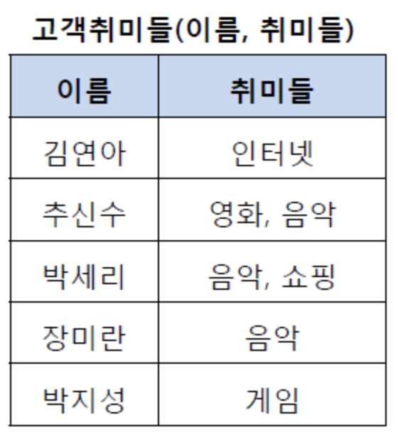 ---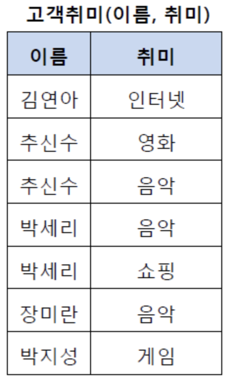

  - 

  - 

  - ## 제2 정규화

    - 제1 정규화를 진행한 테이블에 대해 완전 함수 종속을 만족하도록 테이블을 분해하는 것입니다.

    - 완전 함수 종속이라는 것은 기본키의 부분집합이 결정자가 되어서 안된다는 것을 의미합니다.

    - 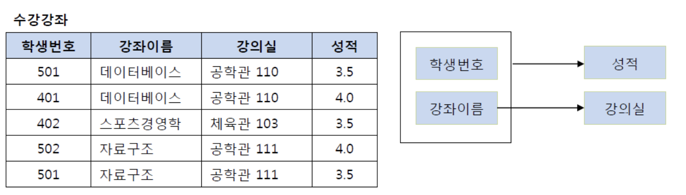

      위 테이블에서 기본키는 (학생번호, 강좌이름) 즉 복합키

      이 키는 강의실을 결정하고 있음: (학생번호, 강좌이름) --> (강의실)

      여기서 강의실은 기본키의 부분집합 중 하나인 강좌이름에 의해서 결정될 수 있음!

      그래서 테이블을 쪼갠다

      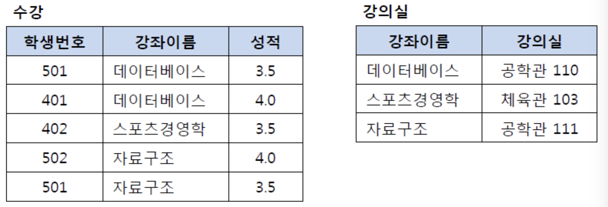

  

  - ## 제3 정규화

    - 제2 정규화를 진행한 테이블에 대해 이행적 종속을 없애도록 테이블을 분해하는 것입니다. 여기서 이행적 종속이란 A->B, B->C가 성립할 때 A->C가 성립되는것을 의미합니다.
    - 이행적 종속을 제거하는 이유는 컬럼 내의 값이 변경될 때 변경된 컬럼 값이 영향을 미치는 다른 컬럼값도 변경해야되는 번거로움을 없애기 위함입니다.

  - ## BCNF Boyce Codd Normal Form 정규화

    - 제3 정규화를 진행한 테이블에 대해 모든 결정자가 후보키가 되도록 테이블을 분해하는 것입니다.

    - 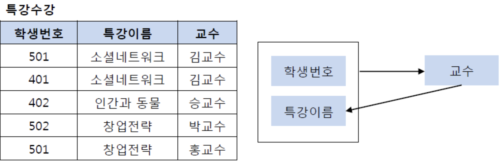

      특강수강 테이블의 기본키는 (학생번호, 특강이름) --> (교수)

      (교수) --> (특강이름) 도 결정하고 있음

      여기서 문제는 교수가 특강이름을 결정하는 결정자이지만 후보키가 아니라는 점

      그렇기 때문에 BCNF 정규화를 만족시키기 위해서 위의 테이블을 분해해야한다!

      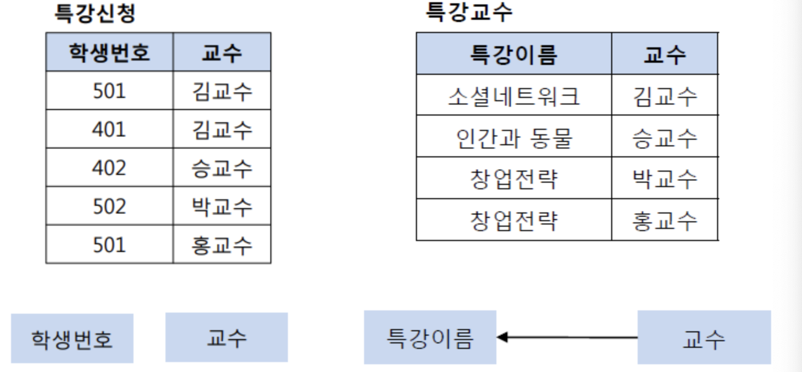

      이렇게!

# **제 4정규화**

- 컬럼이 원자값이 아닌 값을 여러개 갖는 릴레이션(==다치종속)을 분해하여 컬럼이 원자값을 갖도록 하는 정규형입니다.
- 이전 단계인 BCNF를 만족한 상태어야 합니다.
- 다치종속이란 두 개의 독립된 컬럼이 1대 N 관계로 대응하는 것 ->>으로 종속성 표시 !!!

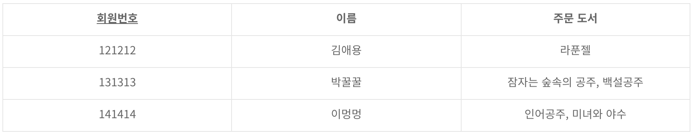

위 표에서 회원번호랑 주문 도서는 다치 종속성 관계:  회원번호->>주문도서
위 표를 아래오 ㅏ같이 바꿀 수 있다

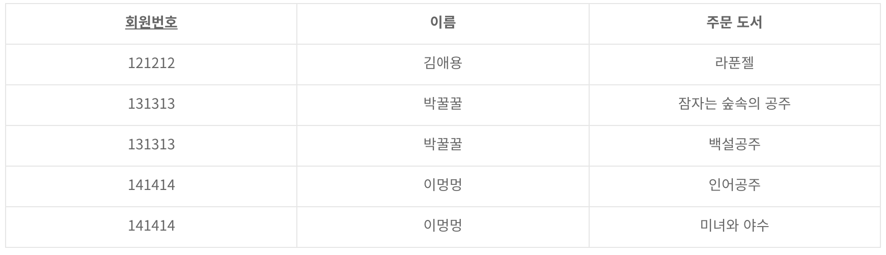

하지만 위는 회원번호랑 이름이 중복된 값이 만들어지는 단점이 있는데 이를 해결하기 위해서 제 4정규화를 진행하는 것입니다.

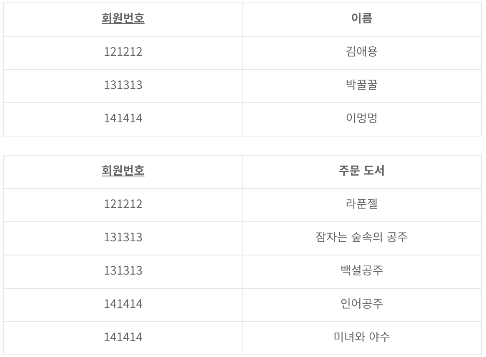

이렇게 두개의 릴레이션으로 분해 !!

# **제 5정규화**

- 조인 속성을 제거

4차 정규화로 아래와 같은 두개의 릴레이션이 나왔다고 가정해보자.

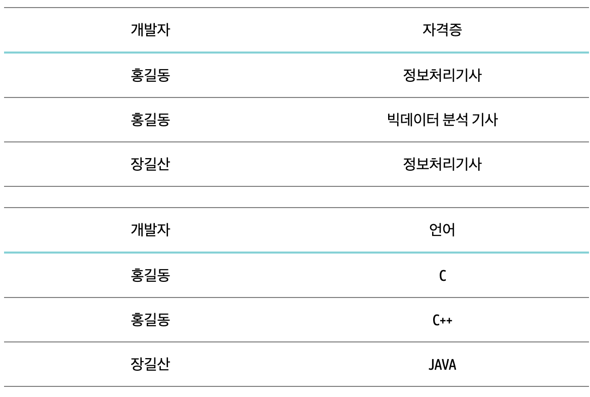

이 릴레이션을 조인연산하면

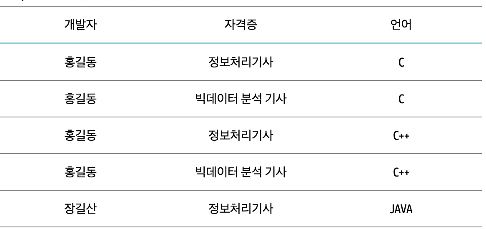

여기에서 나타나는 조인 종속성을 제거해주는 작업을~ 해야함~

* 조인종속성? 테이블을 분해하는건 프로젝션. 분해한 걸 조인에 의해서 다시 원상복구시킬 수 있는가? 있으면 조인종속

​				  개발자

​            /						\

​	자격증			ㅡ			언어

결과적으로

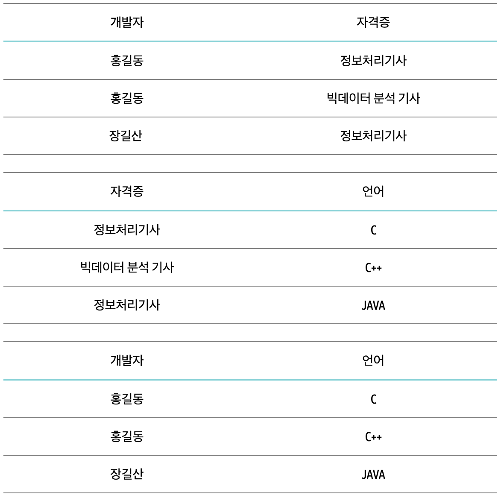

이와 같은 결과가 나오게 하는것이 5차 정규화

# **반정규화?**

정규화는 중복된 데이터를 허용하지 않음으로써 무결성을 유지하는게 목표라면 반정규화는 무결성을 만족시키지 못하더라고 여분(Redundancy)의 컬럼을 남겨두는 것이라고 할 수 있습니다. 이 Redundancy가 무결정에 방해되는 놈.

어느 정도의 편리함을 위해 여분(Redundancy)를 살려둔 것!

예를 들어보겠습니다.

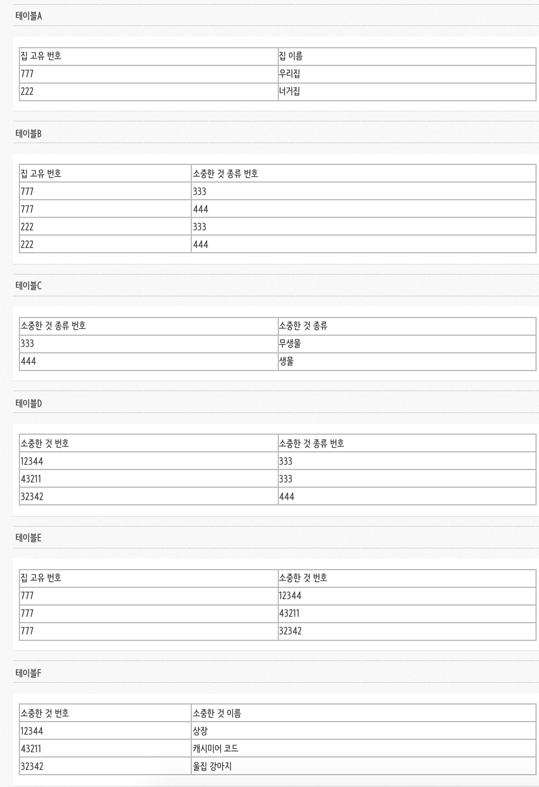

여기서 "울집 강아지"를 찾으려면 테이블 A->B->C->D->E->F 를 타고 내려와야지 찾을 수 있습니다.

하지만 테이블 F에 집 고유번호 열을 하나 **추가**해준다면? A->E->F로 와서 바로 찾을 수 있습니다. 여기서 추가라는게 Redundancy이고 어느정도 편리함을 위해 여분을 살려둔 것이라고 할 수 있습니다.

"어느 정도는 뱃살을 가지고 사는게 편하지 않은가?"

-----

[정규화](https://mangkyu.tistory.com/110)

[이상문제](https://nirsa.tistory.com/107)

[제4정규화, 제5정규화](https://zzozzomin08.tistory.com/12)

[제5정규화](https://nirsa.tistory.com/107)

[반정규화](https://gibles-deepmind.tistory.com/12)
